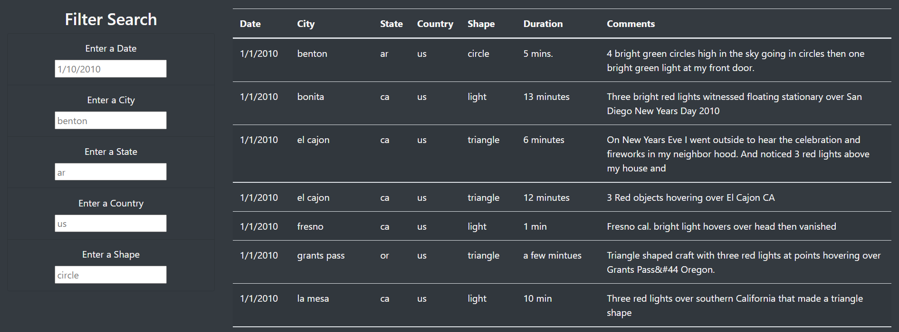
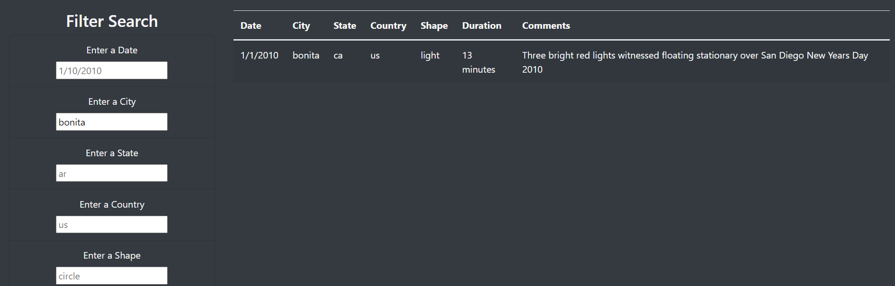

# UFOs
## Overview of Project
In this project, Javascript, HTML, CSS, and Bootstrap was employed to build a dynamic webpage that allows users to invesitgate and filter a data table containing facts about UFO sighting events including the location, date, and other facts regarding UFO sightings.
## Results
The webpage created can be found below: 
[UFO Sightings Webpage](https://andrew-carlson.github.io/UFOs/) 
The webpage allows users to input filter criteria to search for UFO sightings at a certain date, location, or by description:  
  
Below is an example of a criterion that is inputted, and the table updated accordingly:  
  
## Summary
This webpage is useful in that it can quickly filter out by location, date, and shape description of the UFO sighting from the data table. One drawback of this is that one might not have the same exact shape in mind when they utilize the shape criterion. One way the search accuracy can be improved for the user is allowing the user to input a "keyword" that can apply to both the shape and the comments column of the data table. Another possible recommendation is to provide links to the primary source of the UFO sightings if applicable.
